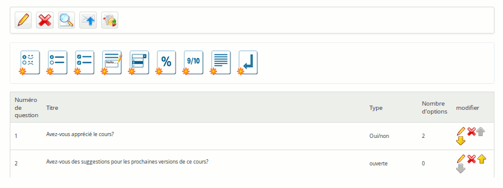

## Ajouter des questions à l&#039;enquête {#ajouter-des-questions-l-enqu-te}

Une fois le squelette de l&#039;enquête créé, c&#039;est à l&#039;enseignant de créer les questions. Dans ce domaine, l&#039;outil « Enquêtes » est particulièrement riche : question ouverte, fermée, pourcentage, réponses multiples, etc.

Illustration 170: Enquêtes - Création des questions