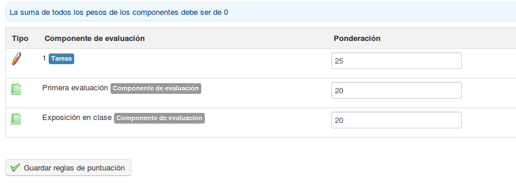

## Gérer les groupes {#g-rer-les-groupes}

La gestion individuelle des groupes fait appel à des commandes connues et à d’autres plus spécifiques à l’outil groupe :

| Icônes | Fonctionnalités |
| --- | --- |
|  | Modifier les paramètres d’un groupe |
|  | Supprimer (après demande de confirmation) un groupe |
|  | Remplir le groupe de façon « aléatoire » |
|  | Vider le groupe |

### La gestion par lots {#la-gestion-par-lots}

La gestion par lots permet, au travers de la sélection par ligne et de la barre déroulante d&#039;actions en bas de la liste de groupes de :

*   supprimer,

*   ajouter des utilisateurs,

*   désinscrire tous les utilisateurs de plusieurs cours simultanément.
