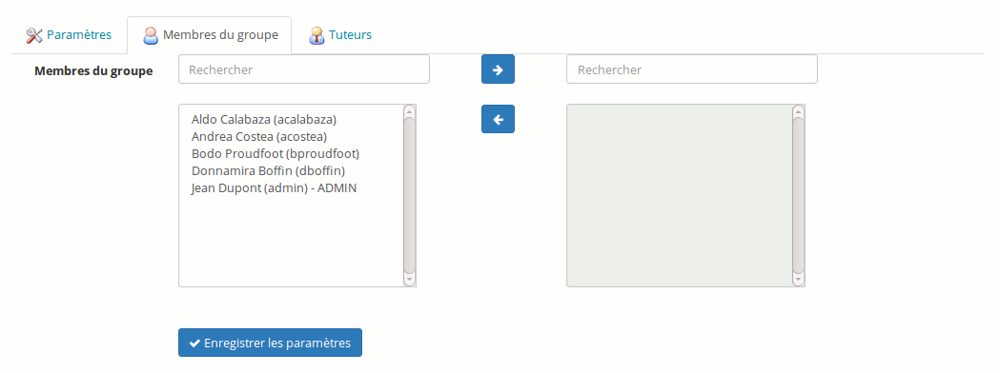

## Remplir un groupe manuellement {#remplir-un-groupe-manuellement}

Dans l&#039;espace de groupe, cliquer sur le lien « Modifier » (le crayon) et ajouter manuellement le(s) tuteur(s) et le(s) utilisateur(s) :

Illustration 166: Groupes - Remplissage manuel