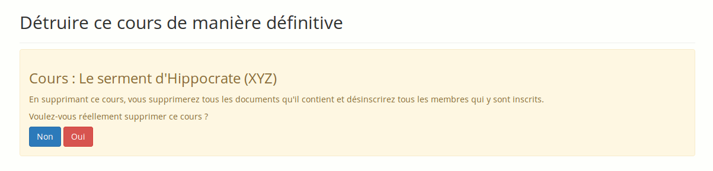

## Vider un cours {#vider-un-cours}

Cet outil vide le cours de l’ensemble ou certains de ses éléments. Il supprime les documents, les forums, les liens, etc. Cette procédure peut être mise en œuvre à l’issue d’un cours ou d’une session de formation.

Attention : Avant de vider le cours, effectuer une sauvegarde complète de celui-ci !

Pour vider le cours de son contenu :

*   cliquer sur le lien « Vider ce cours»,

*   dans la page qui s’affiche, choisir de recycler le cours complet ou quelques-uns de ses éléments (à choisir dans l’écran suivant),

*   cliquer enfin sur le bouton « Vider ce cours » pour lancer la procédure de nettoyage.

Illustration 199: Maintenance - Vider un cours

### Supprimer un cours {#supprimer-un-cours}

Cliquez sur le lien « Supprimer » afin d’éliminer toute trace du cours sur le serveur.

Compte-tenu du caractère irréversible de cette manipulation, un avertissement s&#039;affiche pour éviter l&#039;irréparable.

Attention : Cette fonctionnalité est à manier avec une extrême précaution.

Illustration 200: Maintenance - Suppression de cours