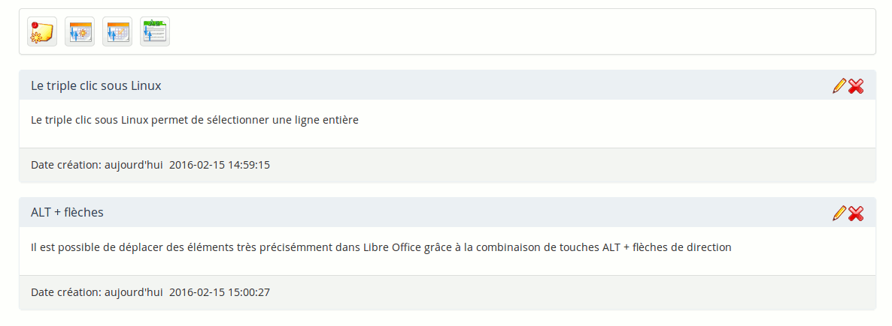

# L&#039;outil « Notes personnelles » {#l-outil-notes-personnelles}

L’outil de « Notes personnelles » est un bloc-notes attaché à chaque cours. Il permet de garder une trace de ce que l&#039;enseignant peut être tenté d’inscrire sur un bloc-notes papier pendant le cours pour être traité ultérieurement. Idem pour l&#039;apprenant.

 Illustration 174: Notes personnelles - Liste

Les notes peuvent être modifiées à volonté et les dates de création et de dernière modification enregistrées. Les notes prises ne sont pas visibles aux autres utilisateurs. Elles conservent donc leur caractère personnel.
