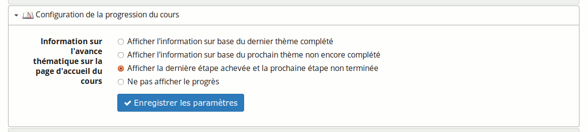

## Configurer la progression du cours {#configurer-la-progression-du-cours}

Permet de changer les informations visibles sur l&#039;avance thématique sur la page d&#039;accueil du cours.

Illustration 194: Paramètres – Progression du cours

Ces options demandent une bonne connaissance et une utilisation avancée de l&#039;outil de _progr__e__s__sion_ _du cours_ (aussi appelé _avance thématique_).

Le résultat de la sélection de la troisième option a déjà été discuté dans la section 25.4 - Visualisation par l&#039;apprenant en page 144.