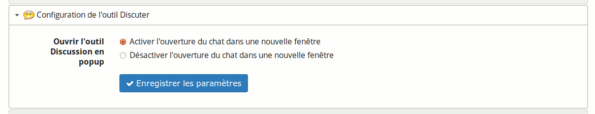

## Modifier le comportement de l’outil « Chat » {#modifier-le-comportement-de-l-outil-chat}

En cochant la case adéquate, l’outil « Chat » (ou « Discuter ») peut être ouvert dans une nouvelle fenêtre.

Illustration 191: Paramètres - Chat