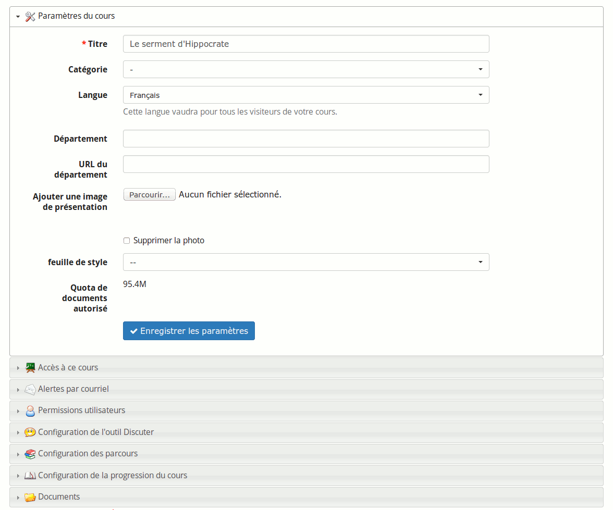
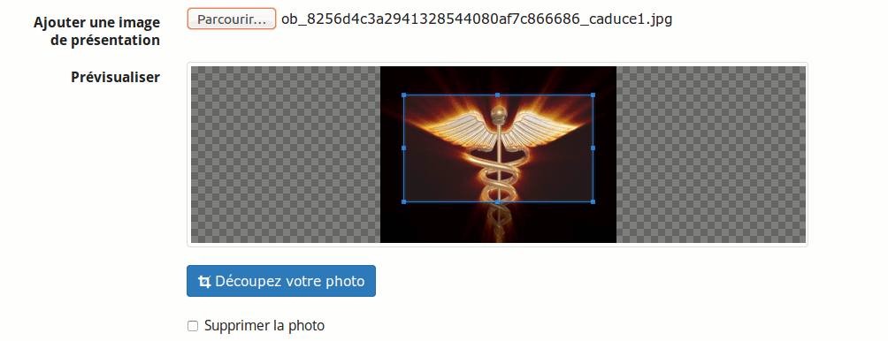
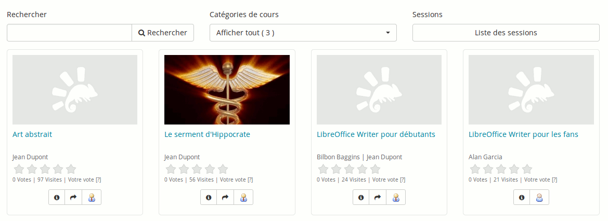
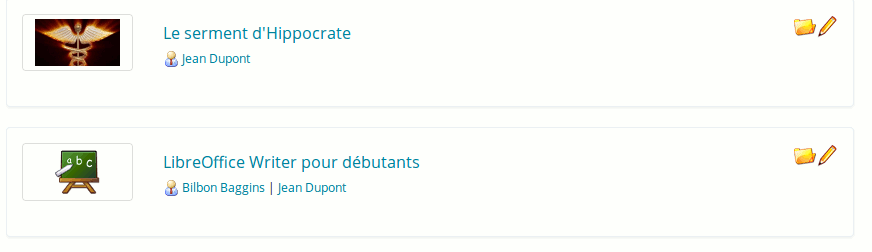

## Modifier les paramètres généraux du cours {#modifier-les-param-tres-g-n-raux-du-cours}

Dans cette section, il est possible de :

*   modifier les enseignants et le nom du cours,

*   modifier la catégorie générale à laquelle le cours appartient,

*   changer la langue dans laquelle l’environnement du cours est dispensé (l’environnement d’un cours peut être affiché dans une langue différente de celle de la plateforme : cela est utile pour les cours en langue étrangère).

Illustration 184: Paramètres - Général

Note : le **_département_**_est une fonctionnalité dont le support a été abandonné. Selon les styles graphiques, le département pourrait apparaître comme un lien dans l&#039;en-tête (pour les styles très anciens). C&#039;est tout ce que cela change._

Vous pouvez également envoyer sur le serveur une image représentative de votre cours.

Illustration 185: Paramètres - Image du cours

Celle-ci apparaîtra dans le catalogue de cours. C&#039;est une façon simple de motiver les apprenants à s&#039;inscrire à votre cours.

Illustration 186: Catalogue de cours - Exemple de cours illustré

Si l&#039;administrateur de la plateforme a activé la fonctionnalité d&#039;utilisation des images de cours dans la liste de cours, l&#039;apprenant pourra également bénéficier de cette image dans sa liste normale de cours.

Illustration 187: Liste de cours
