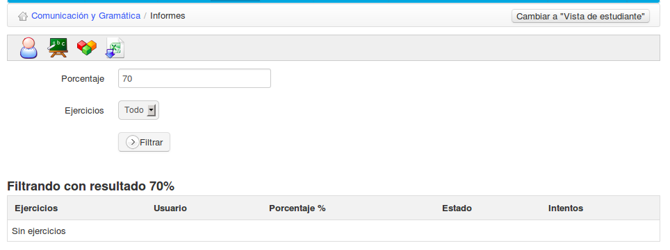
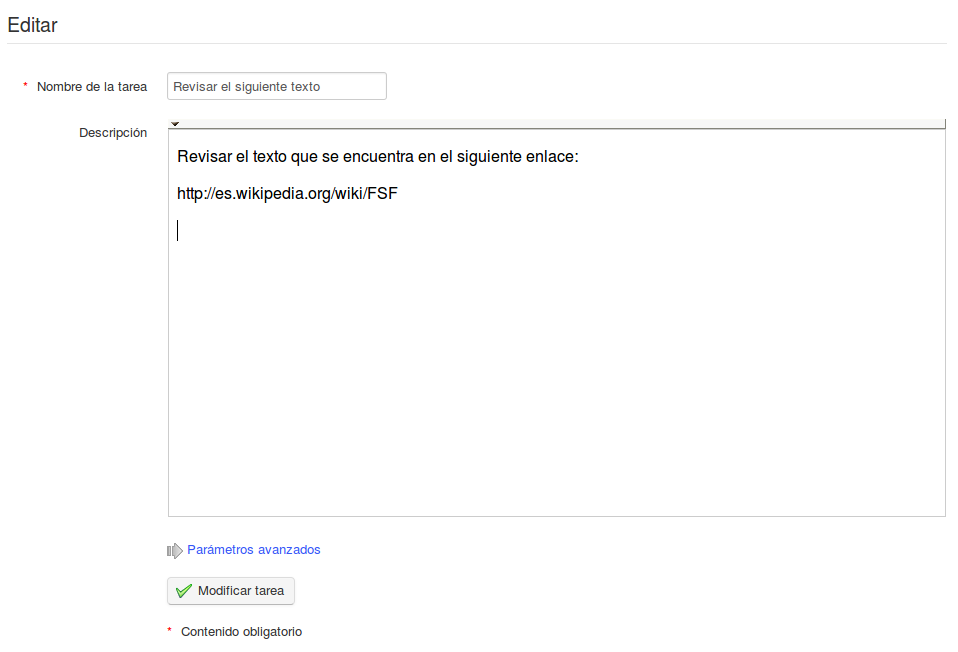

## Administrer (enregistrer, déplacer, supprimer) des fichiers envoyés ou reçus {#administrer-enregistrer-d-placer-supprimer-des-fichiers-envoy-s-ou-re-us}

En plus des commandes d&#039;administration habituelles, il y a des commandes spécifiques à la gestion des fichiers partagés :

| Icônes | Fonctionnalités |
| --- | --- |
|  | Modifier le nom d’un dossier de fichiers partagés |
|  | Supprimer (après demande de confirmation) un dossier de fichiers partagés ou reçus |
|  | Ajouter un « feedback » au fichier partagé |
|  | S’affiche derrière le nom d’un fichier nouvellement envoyé par un autre utilisateur |
|  | Déplacer un fichier vers la racine ou vers un autre dossier |
|  | Sauvegarder sur le disque dur un fichier compressé contenant la totalité des fichiers d’un dossier |
|  | Sauvegarder sur le disque dur une copie d’un fichier |

**Note** : Lorsque l&#039;apprenant supprime un fichier envoyé par ses soins, ce même fichier n&#039;est pas supprimé chez son enseignant.
