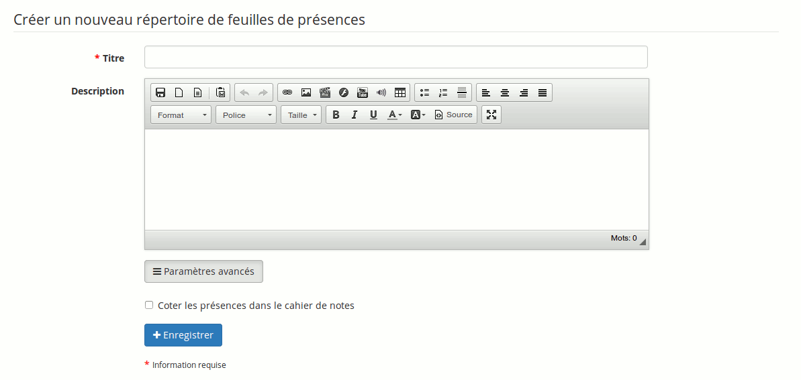
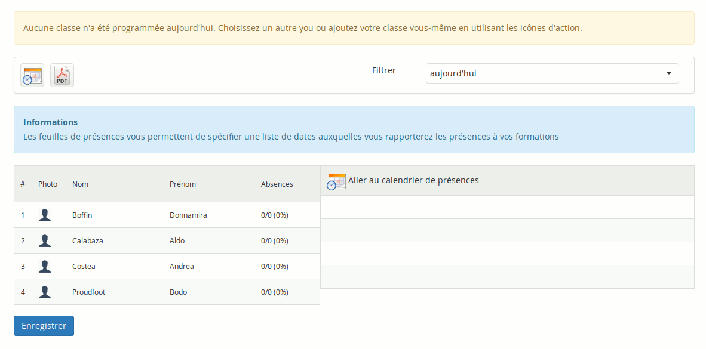
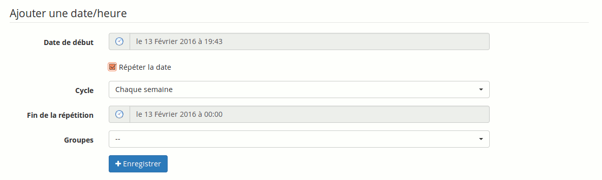
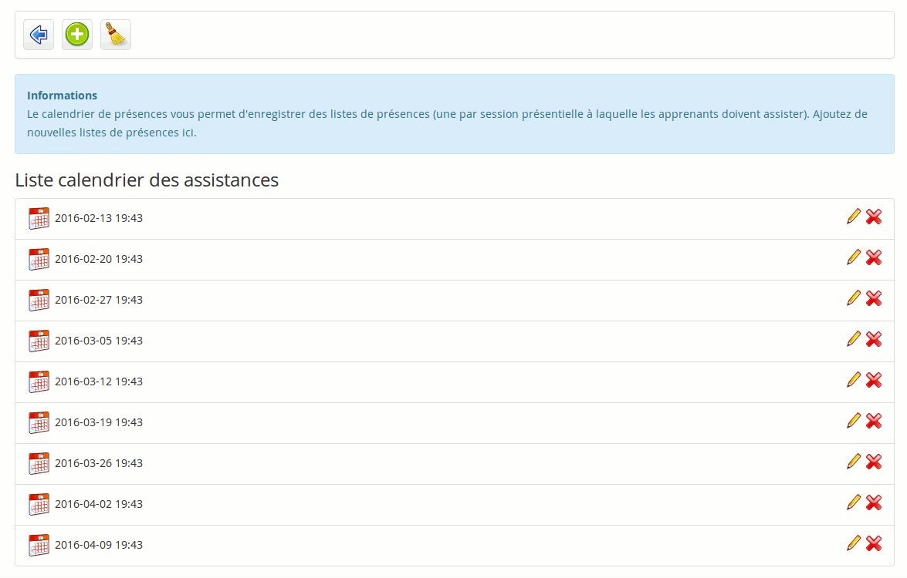

## Créer une feuille de présences {#cr-er-une-feuille-de-pr-sences}

Notez qu&#039;une feuille de présences est déjà créée par défaut. Cette section n&#039;est donc utile que dans le cas où vous auriez besoin d&#039;une seconde feuille de présences.

Le processus de création de feuille de présences est assez long mais nous essayons de l&#039;améliorer et de l&#039;écourter à chaque nouvelle version de Chamilo.

En résumé, il vous faudra

*   créer une feuille de présences

*   voir la liste actuelle de dates (la première fois, il n&#039;y en a aucune)

*   créer une séance/date (avec éventuellement une répétition à une certaine fréquence)

*   retourner sur la feuille de présences et sélectionner le filtre « Tout »

Illustration 137: Présences - Nouvelle feuille de présences

Sur cet écran, cliquez sur la première icône, qui permet d&#039;enregistrer des dates de séances de cours.

Illustration 138: Présences - Étape intermédiaire de la création

Illustration 139: Présences - Liste des séances d&#039;une feuille de présences

Illustration 140: Présences - Création des dates de séances de cours

Sélectionnez la date de la première séance de cours. Si vous désirez indiquer une répétition hebdomadaire, cochez la case _Répéter la date_ et sélectionnez _Chaque semaine_. Ensuite, indiquez la date de dernière répétition de cette séance hebdomadaire.

Illustration 141: Présence - Liste des dates créées

La liste des dates générées apparaît. Vous pouvez les modifier ou les supprimer s&#039;il y a une exception. Ensuite, cliquez sur la première icône pour retourner à la liste de présences.

Illustration 142: Présences - Liste de présences aujourd&#039;hui

Par défaut, ce sont les présences du jour qui apparaissent. Comme il n&#039;y en a pas, la liste est vide. Lorsque vous reviendrez sur la feuille de présences un autre jour, par contre, c&#039;est la liste de présences du jour même qui s&#039;affichera, ce qui est particulièrement pratique. Pour l&#039;instant, sélectionnez le filtre « Tout » et cliquez sur « Filtre ».

Illustration 143: Présences - Liste de présences effective