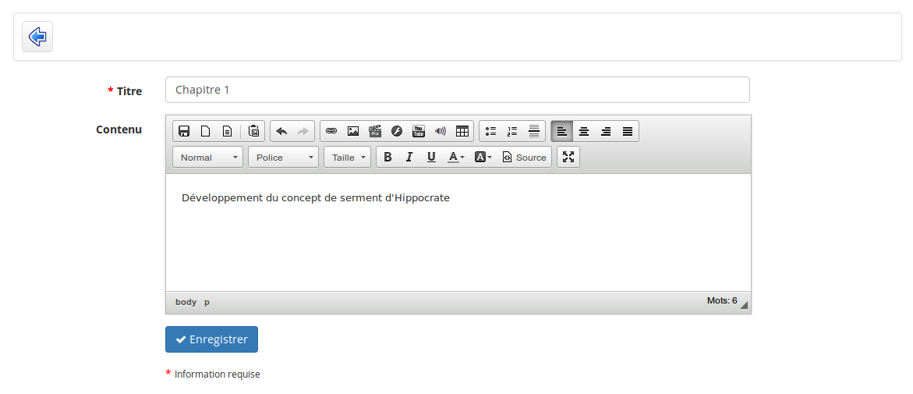

## Créer une section thématique {#cr-er-une-section-th-matique}

Les sections thématiques sont l&#039;unité supérieure dans la création du journal de classe. Il est nécessaire de créer des sections pour pouvoir créer les autres niveaux de structure.

Illustration 145: Progression du cours - Boutons

Pour créer la première section, cliquez sur la première icône.

Illustration 146: Progression du cours - Création