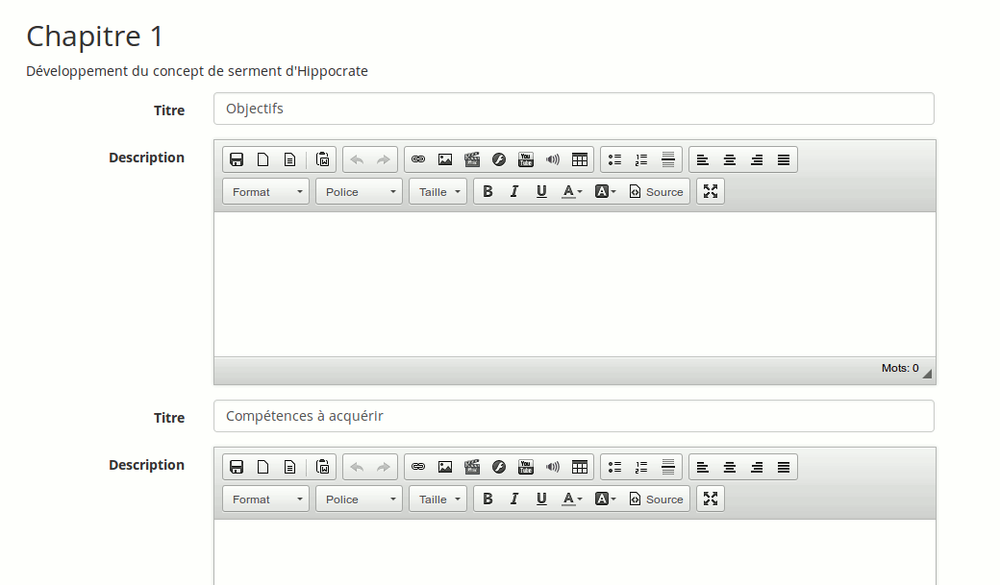

## Définir le plan thématique {#d-finir-le-plan-th-matique}

La section créée, nous pouvons éditer son entrée dans la colonne _Plan thématique_. Le _Plan thématique_ est la définition des objectifs, méthodologie et autres détails de la section du programme de cours créée antérieurement.

Illustration 147: Progression du cours - Plan thématique