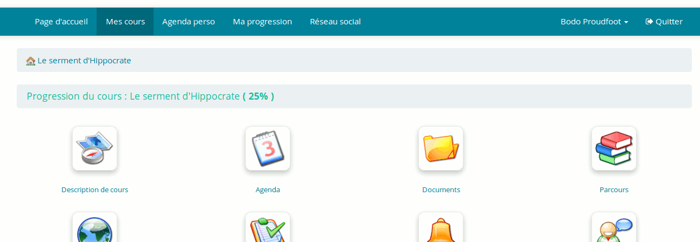
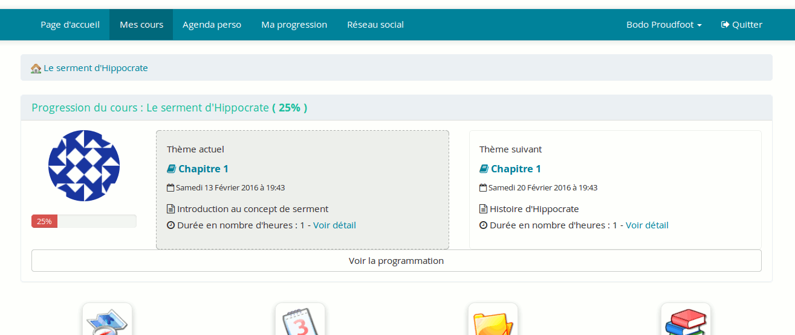

## Visualisation par l&#039;apprenant {#visualisation-par-l-apprenant}

La visualisation, par l&#039;apprenant, de la progression du cours, dépendra de la configuration du cours. Dans la section « Paramètres » du cours, on retrouvera l&#039;option suivante :

Illustration 149: Progression du cours - Options d&#039;affichage

Bien que la première option soit sélectionnée pour des raisons historiques (compatibilité descendante), nous recommandons la 3ème option, qui affichera à la fois la séance terminée et la prochaine séance qui aura lieu. Ainsi, l&#039;apprenant pourra mieux se situer dans le cours en cas d&#039;absence prolongée.

Imaginons donc qu&#039;une fois configurées les différentes étapes (ou séances) de cours, l&#039;enseignant rapporte, dans Chamilo, à la fin de chaque séance, l&#039;étape à laquelle il est arrivé, comme on le voit sur la capture suivante où celui/celle-ci a indiqué avoir achevé la première séance en marquant la première case dans la colonne à l&#039;extrême droite du tableau.

Illustration 150: Progression du cours - Indication du progrès par l&#039;enseignant

Dans ce cas, la progression affichée dans le coin supérieur droit passe à 25 % (des étapes existantes).

L&#039;apprenant pourra donc, dès lors, voir ce progrès au moment d&#039;entrer dans le cours. D&#039;abord de façon relativement discrète, mais il pourra étendre l&#039;affichage de la progression du cours en cliquant dessus pour en voir les détails.

Illustration 151: Progression du cours - Vue courte de l&#039;apprenant

Illustration 152: Progression du cours - Vue étendue de l&#039;apprenant

Différents liens permettent alors à l&#039;apprenant d&#039;en savoir plus sur les étapes parcourues par l&#039;enseignant.