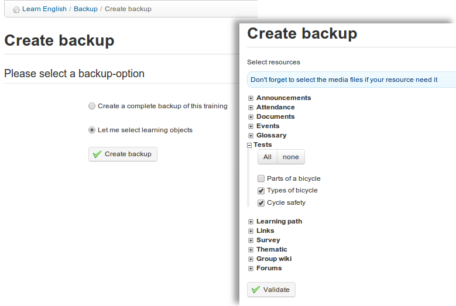

## Crear una copia de seguridad {#crear-una-copia-de-seguridad}

Por motivos de seguridad y de procedimiento, se recomienda que realices una copia de seguridad de los contenidos completos de tu curso. Este proceso está automatizado. Permite crear tanto una copia completa como parcial, basada en tu selección de aquello que desees guardar, con unos pocos clics. Para inicial la copia:

*   clic en el enlace de _Crear copia de seguridad_ en la sección de Copia de seguridad del curso__,

*   en la pantalla siguiente, selecciona si deseas una copia completa o solo de una selección de elementos (en cuyo caso tendrás que seleccionarlos en la siguiente pantalla y hacer clic en _Aceptar_).

*   Clic en el botón de _Crear copia de seguridad_ para iniciar el proceso.

Ilustración 193: Mantenimiento del curso – Crear una copia de seguridad

La copia de seguridad se genera en forma de un archivo comprimido que puedes descargar en tu ordenador. También se almacena en el servidor para una rápida restauración si se necesita.