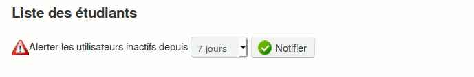

## Afficher le suivi détaillé d’un apprenant {#afficher-le-suivi-d-taill-d-un-apprenant}

Dans le tableau, nous avons caché les noms des participants. On peut y voir également que la plupart des étudiants ne se sont pas connectés récemment. C&#039;est pour cela que leur dernière date de connexion est marquée en orange.

À partir du tableau de synthèse:

*   cliquez sur l&#039;icône de la colonne « Détails », qui est située en face du nom de l&#039;apprenant dont l&#039;enseignant souhaite connaître l’activité exacte. La page qui s’affiche montre l’ensemble de l’activité de l&#039;apprenant à l’intérieur du cours par outil ou par type d’activité,

Illustration 87: Suivi - Détails

*   cliquez sur le lien « Détails d’accès », qui est situé en haut de la page (icône avec graphique), pour afficher la liste des temps et du nombre de connexions de l&#039;apprenant,

*   si cela est nécessaire, il est possible d&#039;imprimer la fiche de suivi détaillée ou bien de procéder à une exportation au format MS-Excel® (.xls).

Illustration 88: Suivi: Détail des temps de connexion d&#039;un apprenant

### Alerter un apprenant inactif {#alerter-un-apprenant-inactif}

À partir du tableau de synthèse des apprenants (de la liste déroulante située en haut de la page), l&#039;enseignant pourra choisir un délai d’inactivité au-delà duquel il faudra « remotiver » un apprenant.

Illustration 89: Suivi - Alerter les apprenants inactifs

Le délai peut être réglé entre 2 et 30 jours. Une icône en forme de point d’exclamation s’affiche à coté des noms des apprenants qui satisfont au critère d’inactivité choisi.

Pour alerter par courriel le(s) apprenant(s) inactif(s) :

*   cliquez sur le bouton « Notifier »,

*   s&#039;affiche alors un écran similaire à celui qui permet de créer une annonce dans lequel les destinataires seront déjà sélectionnés et comportant un messagetype personnalisable,

*   dans « Publier annonce », si la case « Envoyer cette annonce par courriel » est cochée, alors l’annonce sera ajoutée aux annonces classiques du cours (les destinataires de l’annonce seront uniquement ceux concernés par l’inactivité) et les apprenants inactifs recevront le courriel type.

Illustration 90: Suivi - Annonce de rappel

Cet écran est en tous points similaire à celui de l&#039;outil d&#039;annonce. Il utilise, en fait, ce dernier, pour stocker l&#039;alerte envoyée aux apprenants dans le système. L&#039;alerte n&#039;étant envoyée qu&#039;aux apprenants sélectionnés, les autres apprenants ne seront pas au courant de son existence.
