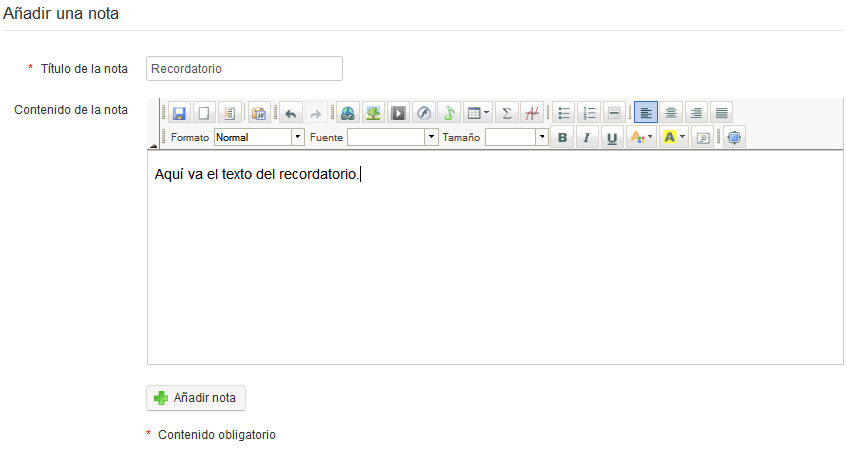

## Creación de notas {#creaci-n-de-notas}

*   Haz clic en el icono para _Añadir una nota_ .

*   Dale a tu nota un título corto.

*   Escribe tu nota.

*   Haz clic en _Crear nota_.

Ilustración 174: Notas personales – Formulario de creación