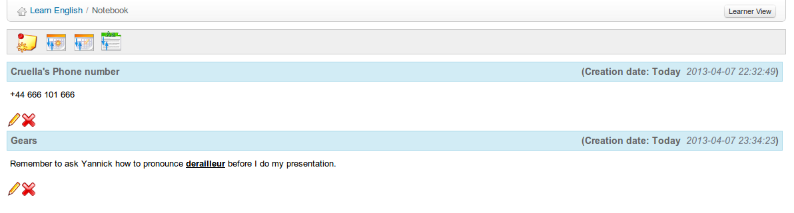

# Notas personales {#notas-personales}

La herramienta _**Notas personales**_ es como un bloc de notas incluido en cada curso. Permite que los usuarios anoten cosas que de otra forma escribirían en un trozo de papel.

*Ilustración 173: Notas personales - Lista*

Las notas se pueden actualizar según sea necesario y también se guardan las fechas de creación y última actualización. Las notas tomadas por un usuario no son visibles al resto de usuarios. En este sentido son, ciertamente, personales.