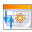

## Ordenar notas {#ordenar-notas}

Mediante las utilidades disponibles en la barra de herramientas de la página de _Notas personales_, las notas se pueden ordenar por fecha de creación , fecha de última modificación  o título .