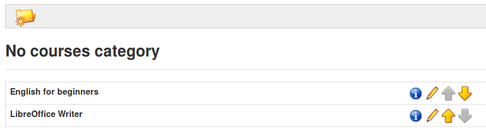
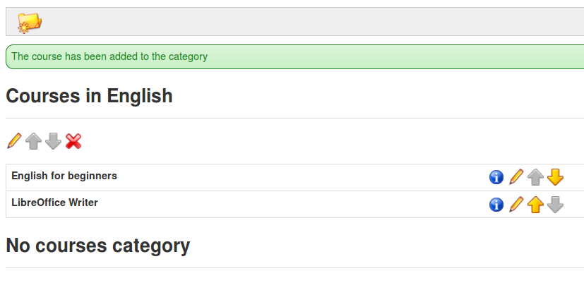

## Categorías Personales {#categor-as-personales}

Para utilizar esta funcionalidad ve a _**Mis curso**s_, selecciona el enlace _**Ordenar mis cursos**_ para llegar a la página de la herramienta de organización de los cursos. Haz clic en la opción _Crear una_ _categoría personal de cursos_, y completa el nombre de la categoría que deseas. Por último, haz clic en el botón _**Añadir categoría**_.

Ilustración 18: Ordenar mis cursos

*Ilustración 19: Formulario de creación de categorías personales*

La categoría personal creada aparece en una lista en la parte inferior de la página. Es posible crear varias categorías personales de cursos.

*Ilustración 20: Categoría personal creada*

Pulsa sobre el icono de lápiz que hay al lado de cada curso para asignarle una categoría. En el menú desplegable que aparece podrás elegir a qué categoría quieres asignar ese curso. Una vez elegida la categoría pulsa sobre el botón de confirmación. Con los cursos ordenados y vinculados a categorías personales, los cursos en la página principal quedan más organizados. Los cursos no asignados a una categoría personal se muestran en la parte superior de la página.

*Ilustración 21: Categorías personalizadas de cursos*

Para eliminar una categoría, pulsa sobre la cruz roja y confirma tu elección.