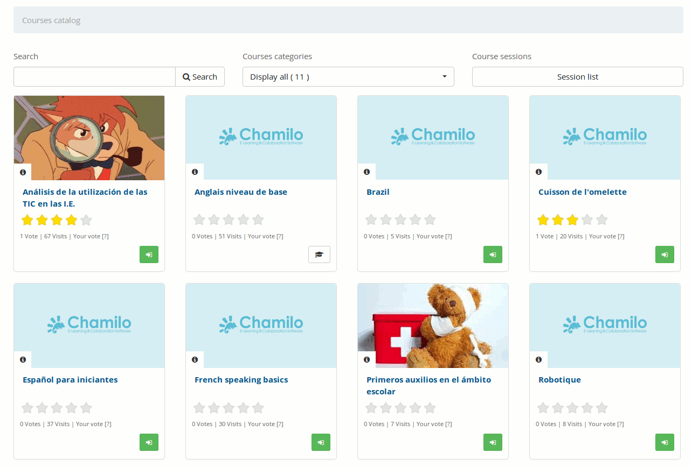

## Suscribirse a otros cursos {#suscribirse-a-otros-cursos}

Tanto los profesores como los estudiantes pueden suscribirse a los cursos existentes en su campus. Si un profesor se apunta a un curso, será considerado estudiante en ese cursos y no tendrá acceso a las herramientas que habitualmente están disponibles para los profesores. Si quieres apuntarte a un curso como profesor, entonces tendrás que solicitarle al propietario del curso que te matricule como tal.

Pulsando sobre el enlace _**Catálogo de cursos**_ aparecerá el listado de categorías con sus respectivos cursos. Para apuntarte a uno, debes pulsar sobre el botón _**Inscribirme**_ (un botón verde con el símbolo de entrada)_._ Puedes utilizar la caja de búsqueda que aparece en el catálogo de cursos para localizar el curso de tu interés.

*Ilustración 22: Catálogo de cursos*

Al inscribirte a un curso, se te asignará el rol de **estudiante** en ese curso.