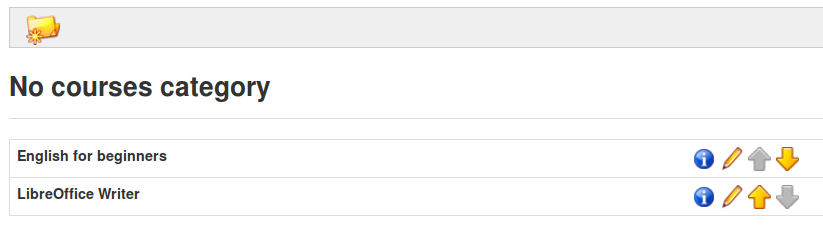
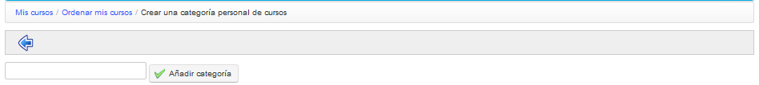
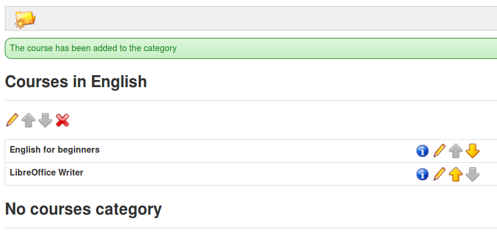

## Categorías Persoais {#categorias-persoais}

Para empregar esta funcionalidade ve a _Os Meus Cursos_, selecciona o enlace _Ordear os meus cursos_ para chegar á páxina da ferramenta de organización dos cursos. Fai clic na opción _Crear unha_ _categoría persoal de cursos_, e completa o nome da categoría que desexas. Por último, fai clic no botón _Engadir categoría_.

Ilustración 18: Ordear os meus cursos

Ilustración 19: Formulario de creación de categorías personais

A categoría persoal creada aparece nunha lista na parte inferior da páxina. É posible crear varias categorías persoais de cursos.

Ilustración 20: Categoría persoal creada

Pulsa sobre o icono de lápiz que hai ao lado de cada curso para asignarlle unha categoría. No menú despregable que aparece poderás elixir a qué categoría queres asignar ese curso. Unha vez elexida a categoría pulsa sobre o botón de confirmación. Cos cursos ordeados e vinculados a categorías persoais, os cursos na páxina principal quedan máis organizados. Os cursos non asignados a unha categoría persoal móstranse na parte superior da páxina.

Ilustración 21: Categorías persoalizadas de cursos

Para eliminar unha categoría, pulsa sobre a cruz vermella e confirma a túa elección.