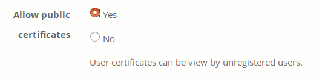

## Iconas de xestión do curso {#iconas-de-xestion-do-curso}

Na interface de xestión de cursos, se atopan as seguintes iconas e botóns:

| Iconas | Funcionalidade |
| --- | --- |
|  | Actualizar/editar un curso |
|  | Eliminar un curso |
|  | Descrición do curso |
|  | Enlace á páxina principal do curso (só estará dispoñible se un curso é público ou está aberto) |
|  | Inscripción ao curso |