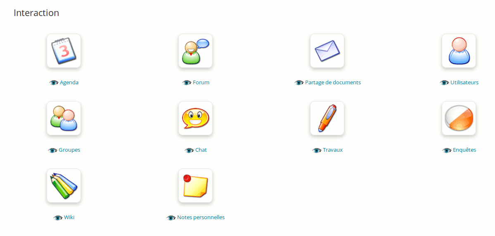

## Outils d'interaction {#outils-d-interaction}

L'objectif de la section d'interaction est de réunir les outils qui permettent une communication entre étudiants et étudiants ainsi qu'entre étudiants et professeurs. À l'inverse des outils de production, l'enseignant n'est pas seul à construire ce qu'on retrouve dans la section d'interaction.

Illustration 23: Outils d'interaction

### Agenda {#magnifieragenda}

Ajouter des événements en choisissant soit « tous », pour que tout le monde puisse voir l'information soit directement, à une personne en particulier, soit à un groupe.

### Partage de documents {#magnifierpartage-de-documents}

Envoyer des documents aux utilisateurs de la plateforme.

### Groupes {#magnifiergroupes}

Créer des groupes dans le cours et administrer l'accès aux différents outils du cours.

### Travaux {#magnifiertravaux}

Regrouper tous les travaux rendus par les apprenants et créer son propre dossier de travaux.

### Wiki {#magnifierwiki}

Créer un wiki propre au cours.

### Forums {#magnifierforums}

Créer un nouveau forum pour le cours en un clic de souris.

### Utilisateurs {#magnifierutilisateurs}

Gérer les utilisateurs du cours, ajouter/supprimer/exporter. Renvoie aussi vers l'outil « Groupes ».

### Chat {#magnifierchat}

Salon de discussion en temps réel type IRC.

### Enquêtes {#magnifierenqu-tes}

Créer une ou plusieurs enquêtes, puis la ou les envoyer aux utilisateurs ou au groupe d'utilisateurs de la plateforme choisie. Cet outil permet aussi de dépouiller l'enquête une fois les résultats collectés.

### Notes personnelles {#magnifiernotes-personnelles}

C'est un bloc notes, il est possible de créer des notes puis de les trier sur plusieurs critères :

* par titre,

* par date de modification / création.

Ces notes sont personnelles. Aucun utilisateur n'a accès aux notes d'autrui.

### Vidéo-conférence {#magnifiervid-o-conf-rence}

Il est assez simple, à condition d'avoir un serveur de vidéoconférence local à disposition, d'installer un outil de vidéoconférence au sein d'un cours de Chamilo, mais il s'agit néanmoins d'une extension qui n'est pas souvent disponible sur un portail classique.

