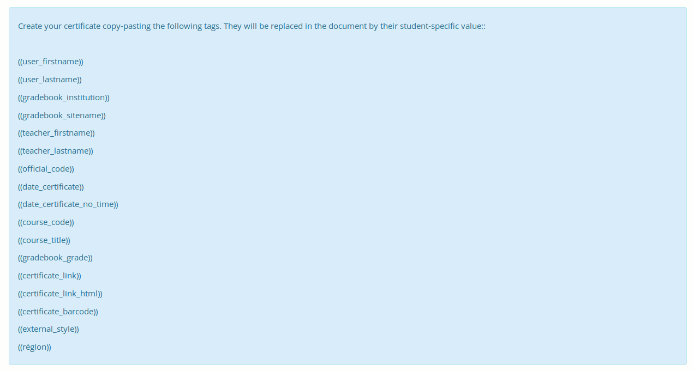

## Elementos comúns da interface {#elementos-comuns-da-interface}

Posto que sabemos que as convencións facilitan as cousas para todos á hora de recordar e xestionar, utilizamos un conxunto de símbolos visuais en todo Chamilo. Estos símbolos poden aparecer sós representando unha acción, ou unidos a outro símbolo para representar o obxeto da acción.

A continuación se relacionan algúns dos símbolos máis comúnmente utilizados na plataforma:

| Iconos | Descripción |
| --- | --- |
|  | A ferramenta lápis permite a **edición** dunha parte específica de información ou contido |
|  | A aspa permite **eliminar** unha parte específica de información ou contido |
|  | O icono do ollo permite cambiar a **visibilidade** dunha parte de información ou contido |
|  | A **estrella amarilla** dentro dun icono simboliza a creación dun novo recurso |
|  | Unha frecha azul hacia a dereita xeralmente indica **mover cousas** ou **insertar cousas** noutras |
|  | Unha frecha azul hacia a esquerda xeralmente significa **voltar** atrás (como o botón de retroceso no teu navegador). |
|  | Unha frecha azul hacia abaixo xeralmente indica **descargar** algún arquivo ou datos. |
|  | Unha frecha azul hacia arriba xeralmente significa **subir** algún arquivo ou datos. |