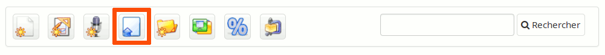
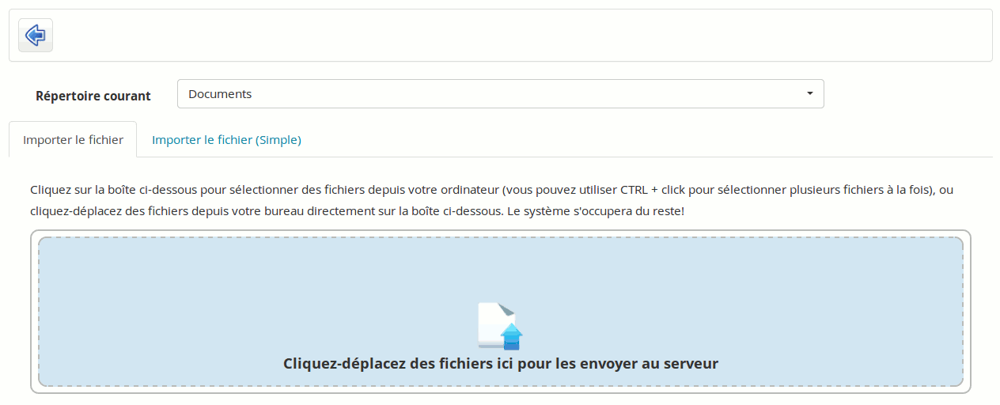
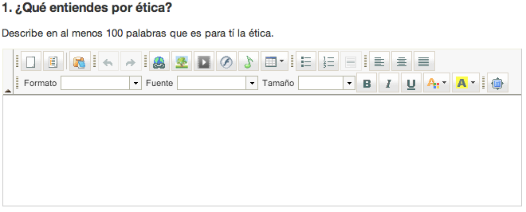
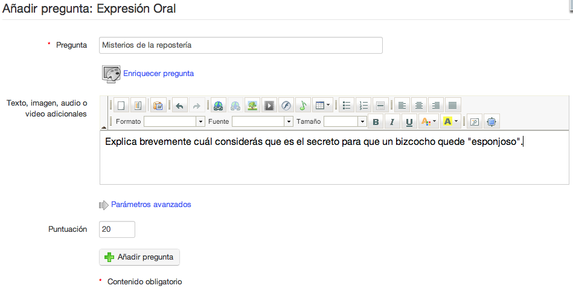

## Importer un document sur la plateforme {#importer-un-document-sur-la-plate-forme}

En vous positionnant dans le dossier désiré puis en cliquant sur l'icône avec une flèche bleue pointant vers le haut \(_Envoyer un document_\).

Illustration 27: Document - Icônes - Envoi

Vous retrouverez un écran similaire à l'illustration suivante :

Illustration 28: Documents - Envoi de documents

Cliquez sur la **zone verte** pour explorer l'arborescence de l'ordinateur et sélectionner le \(ou les[^5]\) document\(s\) à envoyer et cliquez sur le bouton de validation. L'envoi des documents est alors démarré. Si vous envoyez plusieurs documents à la fois, vous verrez leur progrès à la manière de l'illustration suivante.

Illustration 29: Documents - Envoi de documents en cours

Une fois l'envoi terminé, la liste de validation apparaîtra comme dans l'illustration suivante.

Illustration 30: Documents - Envoi de documents terminé

Voilà qui est fait, vous avez envoyé vos documents dans l'outil de documents de votre cours avec succès. Cliquez maintenant sur l'icône de flèche bleue dirigée vers la gauche pour retourner à la liste de documents.

Note : Un onglet _**Envoyer \(Simple\)**_ vous permet d'utiliser le formulaire d'envoi antérieur. Nous l'avons nommé _**Simple**_ car les utilisateurs y sont généralement **plus familiers**, mais il est en réalité légèrement plus compliqué à utiliser. Vous pourrez y trouver également les **options d'indexation** des documents \(au cas où votre administrateur aurait activé la recherche indexée\) ainsi qu'une option pour décompresser une **hiérarchie entière** \(zippée\) de documents.

[^5]: Pour sélectionner plusieurs documents, utilisez une combinaison de la touche CTRL et du clic-gauche.

