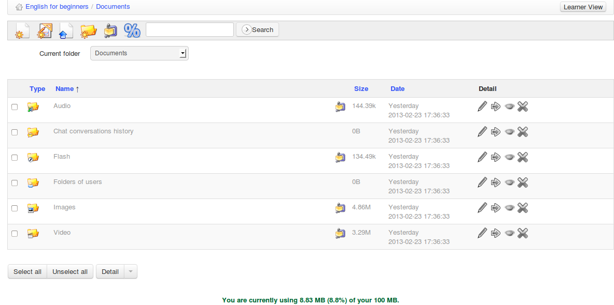

## Cambiar rápidamente de directorio {#cambiar-rapidamente-de-directorio}

Cando creamos un curso novo con contido de exemplo, a ferramenta Documentos contén varios directorios (_audio, flash,_ _imaxes__,_ etc) por defecto.

Estos directorios están destinados a proporcionar axuda adicional para organizar os recursos dentro do curso. Unha vez que se teñen 20 ou máis documentos no directorio raíz, vólvese difícil localizar un documento cando se precisa, porque terás que deslizar a pantalla arriba e abaixo para conseguir ver todos os ficheiros. Por iso, recomendamos non ter máis de 20 ficheiros por cartafol – boa práctica xeral en cualqueira xestión de arquivos.

Eses directorios, por defecto, son invisibles para os alumnos. É decisión do profesor se os alumnos deben ou non ver o seu contido (facendo clic na icona do _ollo_).

Ilustración 30: Documentos – Lista de directorios por defecto

Por suposto, é posible crear outros directorios empregando a icona de crear cartafol. Para navegar rápidamente dentro da árbore de directorios, unha lista desplegable, denominada _Cartafol actual_ está dispoñible na parte superior esquerda da pantalla, permitindo acceder a cualqueira nivel de directorios en documentos.

Unha vez dentro dun directorio, a icona de “subir un nivel”  permite ao profesor voltar atrás un nivel.