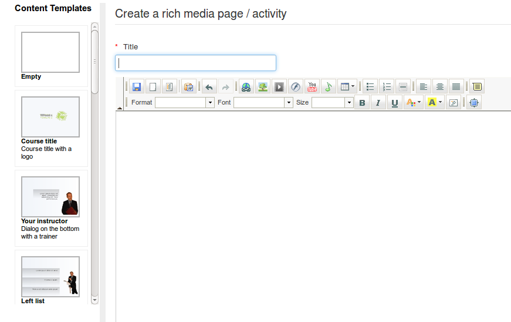

## Creación de contido en Chamilo {#creacion-de-contido-en-chamilo}

Unha grande ventaxa de Chamilo fronte a outros sistemas de xestión do aprendizaxe (LMS) é que proporciona un amplio abanico de características para a creación efectiva de contido no curso. A barra de ferramentas da parte superior da páxina de documentos mostra un rango de utilidades de apoio á autoría de contido. Algúns destas iconas aparecen únicamente cando a opción correspondente foi activada polo administrador.

Ilustración 34: Documentos – barra de ferramentas

As iconas marcadas cun asterisco amarelo representan ferramentas de creación. En primeiro lugar, o profesor pode crear documentos multimedia enriquecidos directamente a través da ferramenta documentos, sen necesidade de sistemas externos de autoría. Simplemente facendo clic na icona de _crear un documento_  dentro da carpeta desexada aparece un completo editor online.

Ilustración 35: Documentos – Crear un novo documento

Despois de asignar un nome ao documento, é posible utilizar todas as opcións no editor de texto incrustado para dar formato ao documento. O editor soporta un amplio rango de elementos, incluindo táboas, imaxes, audio, vídeo, Flash, etc. Inclúe un editor html, o que implica que, para aqueles con coñecimentos de programación, ¡non hai límite en términos de enriquecer o contido!

Podes tamén empregar unha serie de plantillas para documentos (dispoñibles na columna esquerda), ou crear e gardar as túas propias plantillas para deseñar novas páxinas.

Unha vez que o documento foi creado/editado, gárdao facendo clic no botón de _Crear un documento_.

Outros tipos de documentos poden ser creados dependendo do teu navegador e da configuración do portal (consulta ao teu administrador sobre habilitar estas características extra se non as ves na barra de ferramentas).

| Icono | Característica |
| --- | --- |
|  | A utilidade de _debuxar_ permíteche trazar diagramas ou esquemas en formato vectorial[^8], que pode ser re-editado ou exportado a mapa de bits. |
|  | A utilidade de _retoque fotográfico_ é moi similar a _Photoshop_® e permite editar, recortar, colorear, etc., fotografías e outras imaxes de mapa de bits. |
|  | A ferramenta de _grabación de audio_ permite grabar pistas de sonido directamente dende o teu navegador, usando o teu micrófono (nun portátil, o micrófono xeralmente está integrado). Requírese soporte de Flash® o applets de Java® no navegador para elo. |
|  | A utilidade de _crear audio dende texto_ permite facer que o ordenador fale por ti. Próbao. Sorprenderache pola calidade das voces xeradas. |
|  | A ferramenta _webcam clip_ permíteche grabar un fotograma directamente dende a túa webcam. Requírese Flash®. |

[^8]: En todos os navegadores recentes excepto Internet Explorer 6, 7 e 8, onde esta característica non está implementada.