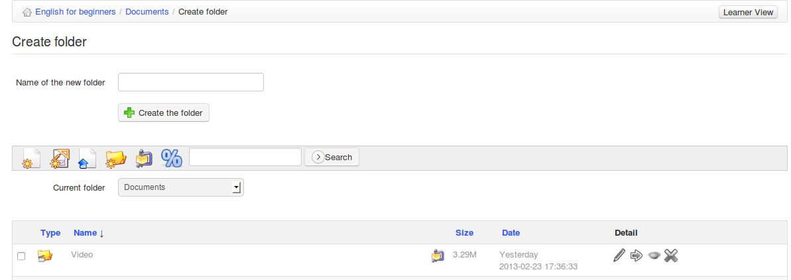

## Crear un directorio {#crear-un-directorio}

Para lograr una clara estructura de almacenamiento, Chamilo te permite crear directorios (carpetas) y subdirectorios haciendo clic en el icono de carpeta con el asterisco amarillo  .

*Ilustración 29: Documentos – crear directorios*

Para crear un directorio:

*   clic en el icono de _**Crear carpeta**_,

*   introducir el nombre del directorio,

*   clic en el botón de _**Crear la carpeta**_,

*   el nuevo directorio ha sido creado y puedes utilizarlo ya para almacenar nuevos documentos.

Si quieres crear un subdirectorio, abre el directorio donde quieres crearlo y sigue el mismo procedimiento.