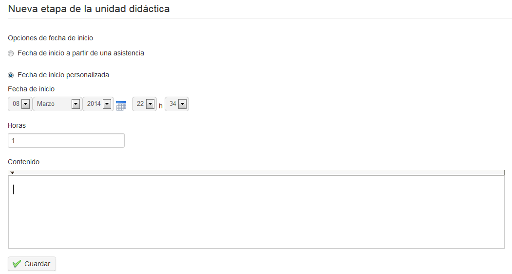
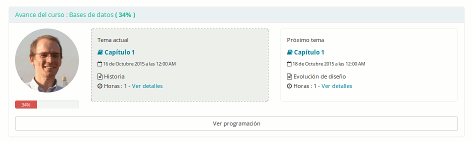

## Crear etapas de avance temático {#crear-etapas-de-avance-tem-tico}

Las etapas (llamadas _Avance temático_) son las fechas en las cuales dictarás el contenido específico de la sección temática correspondiente. Habiendo guardado el _plan temático,_ regresa a la página principal de _Avance temático_ haciendo clic en la navegación horizontal en migajas de pan y luego en el icono__de _Nuevo avance temático_ en la sección correspondiente.

*Ilustración 152: Avance temático – Creación de pasos*

Aquí puedes ingresar la fecha para cada sesión de aprendizaje y los contenidos de lo que será cubierto específicamente en esta sesión. Puedes ingresar fechas (y horas) manualmente, o simplemente vincularlas desde las _hojas de asistencias_ si ya definió algunas. Donde esté usado el _avance temático_, el avance se mostrará en la página principal del curso (a menos que otras opciones hayan sido seleccionadas en las opciones de configuración del curso):

*Ilustración 153: Avance temático visto por el alumno en su pantalla principal de curso*