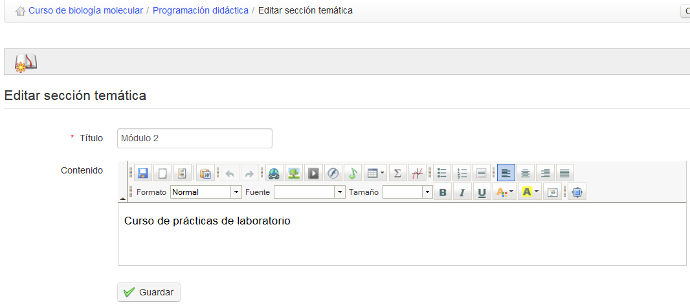
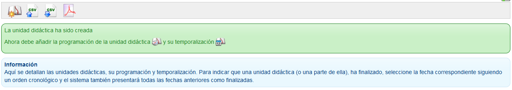

## Crear una unidad didáctica {#crear-una-unidad-did-ctica}

Las unidades didácticas representan el mayor nivel en la estructura de la programación. Necesitas crear unidades para poder crear otros niveles en la estructura.

Para crear la primera unidad, haz clic en el icono de _Nueva unidad didáctica_ y completa los campos principales utilizando texto, imágenes, etc.

Ilustración 149: Programación didáctica – crear unidad didáctica

Cuando hagas clic en _Guardar_ se te invitará a crear una nueva programación de esta unidad:

Ilustración 150: Programación didáctica – invitación a crear una programación: