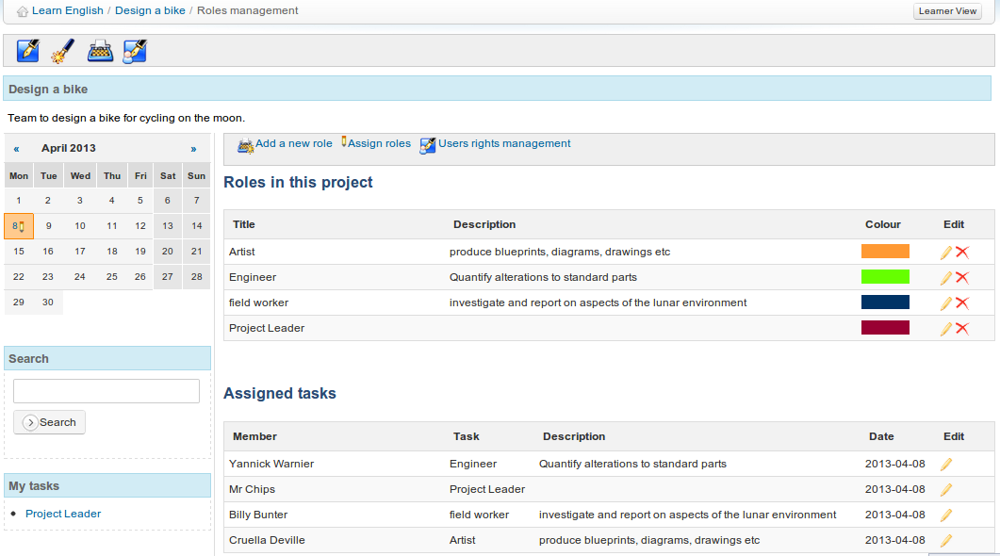
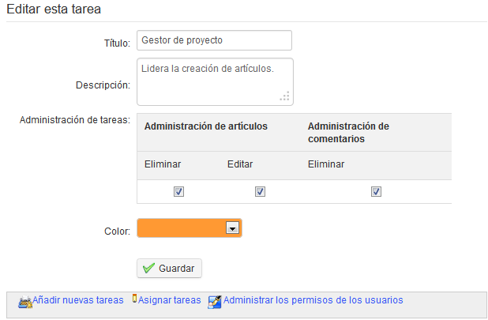

## Roles management {#roles-management}

The _Roles management_ icon  displays a page listing the roles/tasks created and assigned to users:

*Illustration 166: Projects - Roles management*

From the _Roles management_ page you can create detailed tasks of a project step or assign roles to the members of a project.

To create a new task/role:

*   click the _Add a new role_ icon ,

*   give the role a title, description and assign permissions,

*   choose a color using to the drop-down bar,

*   click _Save._

*Illustration 168: Projects – New role*

→ The new role appears in the roles list.