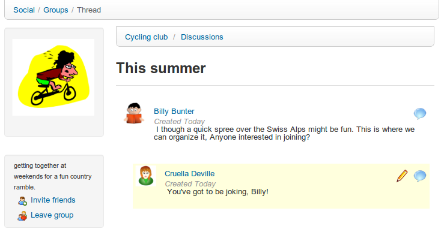

## Grupos {#grupos}

El enlace de _**Grupos**_ __ une a todos los grupos que existen en la plataforma. Estos grupos solo pueden ser creados por los administradores, al menos que se habilite la opción para todos los usuarios.

Existen dos tipos de grupos dependiendo de su tipo de acceso:

*   Públicos (cualquiera se puede unir).

*   Privados (el administrador del grupo debe autorizar las solicitudes para unirse)

A partir de la versión 1.10.0 de Chamilo, los grupos sociales son principalmente _clases_, que pueden ser marcadas como grupos sociales para beneficiarse de sus funcionalidades relacionadas.

*Ilustración 203: Red Social – Grupos*

La pestaña de _**Mis Grupos**_, muestra una lista de los grupos a los que perteneces. Estos grupos funcionan de manera similar a un foro, dónde el administrador (o moderador) crea lo temas de discusión para que los usuarios comiencen a contribuir.

*Ilustración 204: Red Social – Interfaz de los grupos*