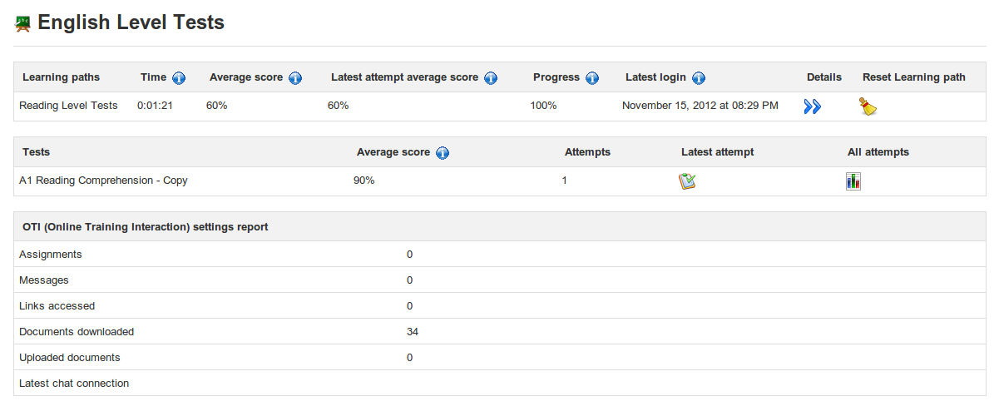
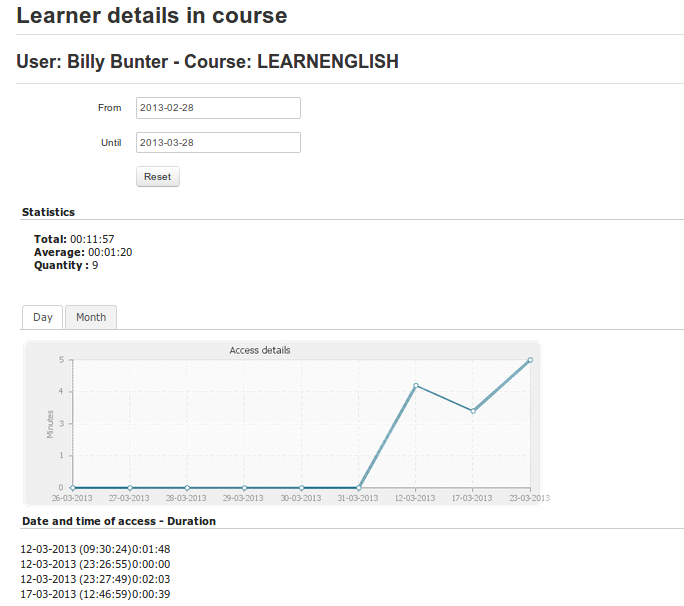

## Show individual learner&#039;s details {#show-individual-learner-s-details}

On the _Reporting_ page, click the _Details_ icon  next to the name of the learner you want to check on. The new page shows the learner&#039;s details in summary, including profile information, photo, connection and summary progress details, but also detailed information about the student&#039;s progress through each learning path, results in tests, and potentially useful information about other activities such as assignments, messages sent, links visited, documents uploaded and chat.

*Illustration 88: Reporting – individual student&#039;s details*

The information can be printed  , exported as a csv file  or mailed  by clicking on the relevant toolbar icon at the top of the page. Further details about test attempts and scores and progress through learning paths can be accessed by clicking on the various icons on the page.

Clicking on the _Access Details_ icon  in the toolbar allows the teacher to see the course (times and dates) . This general reporting screen gives a general idea of the participation of the learner, which is useful for judging of the involvement of the learner inside the course.

*Illustration 89: Users – Access details*