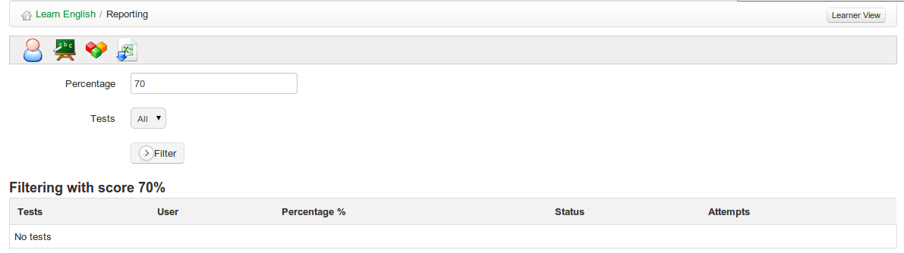

## Test/exam Reporting {#test-exam-reporting}

The exam tracking tool is useful for teachers wanting to focus on monitoring learners&#039; performance in tests. By clicking on the _exam tracking_ icon  on the main reporting page, the teacher is provided with a list of tests and students&#039; scores/percentages, including number of attempts. They can select individual tests and filter results by a given percentage e.g. to display a list of students passing a course, or excelling in their score. This data can be exported as a standard MS-Excel file®.

Illustration 91: Exam tracking