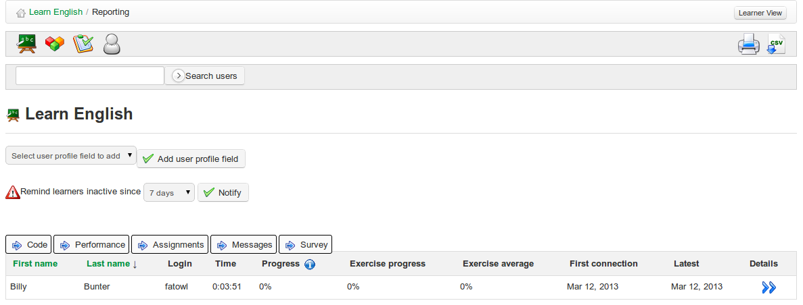

## Tracking learners {#tracking-learners}

By default, clicking on the _Reporting_ icon will display summary details for a list of learners on the course. It includes summary information about test scores, time spent on-line, login details etc.

Illustration 87: Reporting – Learners

On this page the teacher, as well as viewing a summary table of students&#039; overall activity and progress, can easily add columns to the table drawing on students&#039; profile information (country, date of birth) as well as data held elsewhere in the course (course code, performance data, assignments, messages, surveys). He/she can highlight learners absent from the course for a specified length of time and at one click notify learners with an appropriate announcement using a configurable announcement tool (see chapter 21) accessed by clicking the notify button  . The teacher can also print out the table  or export it as a csv file .