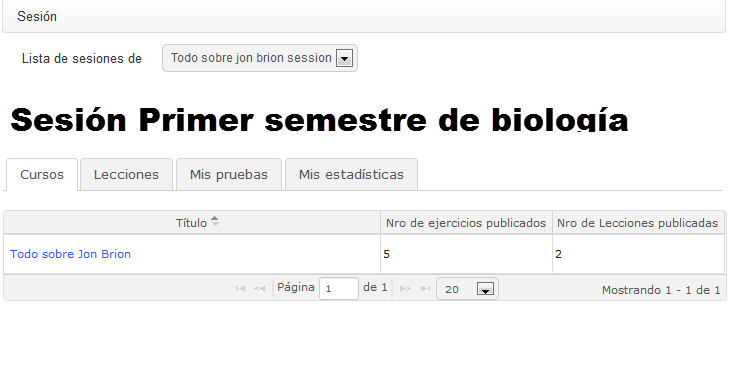

# Session view {#session-view}

From Chamilo 1.8.8 platforms onwards, if your platform uses _Course sessions_ a new view type has become available from the _My courses_ tab. This is a special “sessions” view, which you will find is a very different way of presenting courses and tools (specifically learning paths and tests).

*Illustration 195: My courses - Sessions*

One main difference from previous versions of Chamilo is that the session title is now a link which leads directly to a page whose appearance differs in many ways from the rest of Chamilo. (This is a new format of presentation that we will be studying over the next few months, and we&#039;re counting on your help and feedback. Do let us know what you think on the Chamilo forum: [http://www.chamilo.org/](http://www.chamilo.org/))

This new concept relies essentially on a new way of setting up tests and learning paths based on timescales. By making sure each exercise and learning path has a start and end date, the data shown in these screens make far more sense. (As such, it is not well suited to asynchronous teaching i.e. purely remote e-learning, with its relatively free timescales.)

*Illustration 196: Sessions – New session screen*

Click on the relevant session icon  displayed in the _My courses_ page The main screen displays four tabs: _Courses, Learning paths, My MCQ (Multiple Choice Questions), and My statistics_