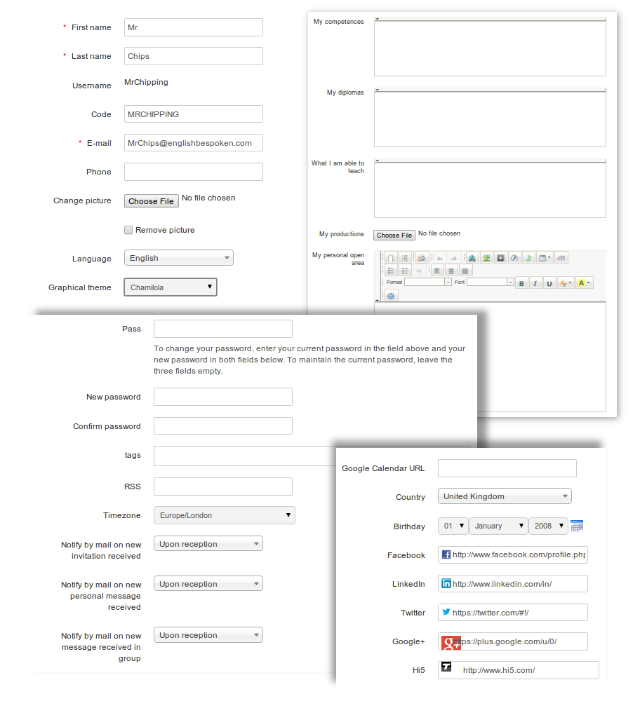

## Profile information {#profile-information}

To enter/edit your personal details, go to the _Social network_ tab:

*   click the _Edit profile_ link,

*   update the fields,

*   click _Save settings_.

Profile options allow you to edit your _name_, your Chamilo _code_, your _email_ and you _phone_ number, as well as a profile _picture_ and preferred _language_. Other fields (if enabled by the administrator) allow you to choose a _graphical theme_ and enter details of personal _competences_, _diplomas_ (qualifications), and _what you are able to teach_. You can upload any relevant file using _productions_, and write any other relevant information in m_y personal open area_. More recent versions of Chamilo also invite you to enter/edit your _password_, _tags_, _rss_ _feeds_, _timezone_, _email_ _notifications_, your _Google calendar URL_, your _country_, your _birthday_ and even a range of personal social networking links:

Illustration 188: Social network – Extended profile update

Remember to click the _save_ button when you've completed entering/editing your profile details!