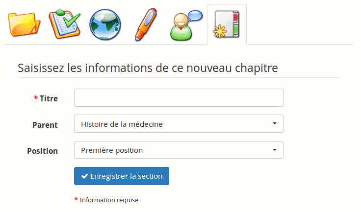

## Ajouter une activité / un objet {#ajouter-une-activit-un-objet}

Cet onglet se compose de deux parties, l'une pour créer directement un parcours à partir de Chamilo, l'autre pour ajouter des ressources pouvant être externes en téléchargeant des ressources sur la plateforme :

Illustration 69: Parcours - Édition des composants

### Créer une nouvelle activité / page multimédia {#cr-er-une-nouvelle-activit-page-multim-dia}

Illustration 70: Parcours - Création de document en ligne

Cette option permet de générer un document qui sera ajouté au parcours et enregistré au format _.html_ dans les documents du parcours.

Il est possible d'utiliser les styles, d'ajouter des images, des vidéos, etc. C'est un outil complet de création de parcours.

### Utiliser une ressource existante {#utiliser-une-ressource-existante}

On peut importer un document qui a été préalablement importé dans les documents du cours \(par exemple, un cours SCORM, des pages en .html, des vidéos, des images, etc. : _cf_ _Créer un nouveau document\_\_en page_ _35\_\_\)._

On peut ajouter des tests, des liens, des travaux et des forums. La ressource apparaît alors dans le fil d'Ariane \(l'encadré gris\) à la suite du parcours.

Les liens, les tests, les travaux et les forums peuvent être créés à l'avance dans la catégorie « Production » ou « Interaction », puis ajoutés de cette manière dans le parcours, ou bien être créés directement via la section d'édition :

Illustration 71: Parcours - Importation de ressources existantes

### Ajouter une nouvelle section {#ajouter-une-nouvelle-section}

Illustration 72: Parcours - Nouvelle section

Permet de séparer des parcours pour différencier plusieurs catégories, chapitres, etc., dans le parcours.

### Prévisualiser {#pr-visualiser}

On peut ensuite prévisualiser le résultat de la création du parcours en utilisant l'icône de loupe:

Illustration 73: Parcours - Vue utilisateur

Sur cette page de prévisualisation, on retrouve les éléments suivants, de haut en bas et de gauche à droite :

1. une barre de menu \(invisible pour les apprenants\) qui permettra de revenir à la liste des parcours rapidement

2. une photo \(c'est celle par défaut qui s'affiche ici\) permettant d'illustrer le sujet avec une image ou la photo du professeur du cours

3. une barre de progrès de l'apprenant au sein du parcours \(en pourcentage\)

4. des boutons de contrôle pour revenir aux écrans d'édition

5. les différents éléments \(diapositives\) du parcours \(tous décochés parce qu'ils n'ont pas été consultés\)

6. une barre d'icônes \(en haut à droite\) qui permettent de changer le type de visualisation, de revenir à la page principale du cours, de voir son progrès, de revenir à la diapositive précédente, de passer à la diapositive suivante

7. le contenu \(diapositive\) lui-même

