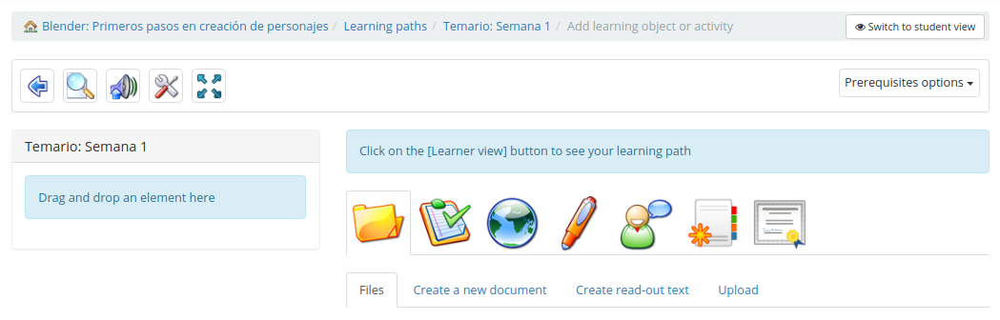
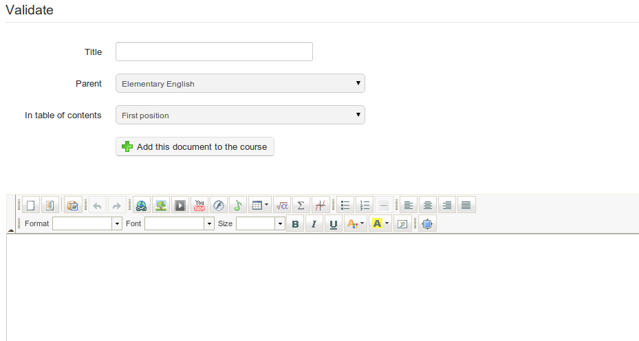
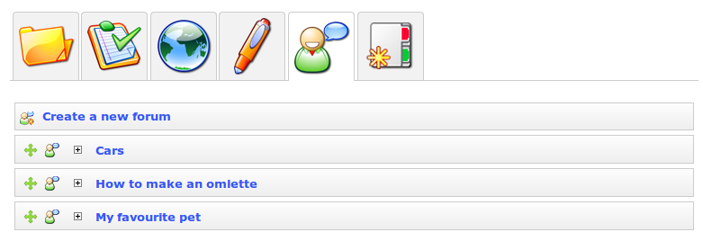
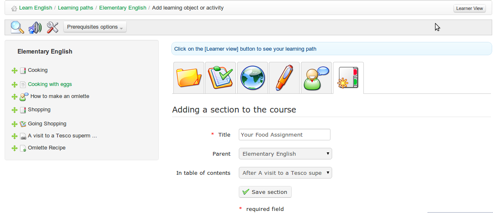
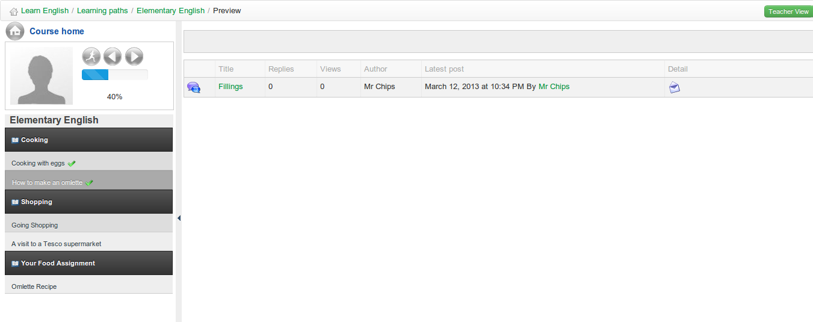

## Add Learning Objects and Activities {#add-learning-objects-and-activities}

As you build your learning path/course, you have the option to include existing learning objects or activities or to create your own using Chamilo.

*Illustration 78: Adding a learning object or activity to a course*

### Create a new document {#create-a-new-document}

This option allows you to generate a document which will be automatically added to the learning path and saved in _.html_ format in the learning path documents.

In essence, it is possible to use the rich text editor to edit styles, add images, videos, etc. You can toggle between html and the WYSIWYG editor to produce whatever content you wish. In other words, Chamilo provides you with a complete learning path creation tool.

To begin, click the _Rich media page / activity_ icon  to see the following page:

*Illustration 79: Learning paths – Rich media creation tool*

### Use existing resources {#use-existing-resources}

You can use any document you have previously imported or created in the documents tool of the course (e.g. a SCORM course, _.html_ pages, videos, images, etc. - see_Authoring content in Chamilo__)._

You can also add tests, links, assignments and forums by dragging them across to the learning paths list on the left of the page using the green “handle”  . The chosen resource will appears in the wherever you choose in the learning path. Use the handle to re-order items, and the pencil  and cross  icons to edit/delete elements.

Links, tests, assignments and forums can be created prior to building the learning path in the _Authoring_ or _Interaction_ sections on your course&#039;s homepage, and then added from these sections into your learning path via the relevant tab on the learning path page. (Alternatively, they can be created directly from within the tabs themselves as you build the learning path:)

*Illustration 80: Learning paths – Importing existing resources*

### Add a new section {#add-a-new-section}

The _Sections_ tool  is a simple but effective tool allowing you to group activities in the the learning path under headings for clarity.

*Illustration 81: Learning paths – New sections*

### Display the learning path {#display-the-learning-path}

Display the results of the learning path you just built:

*Illustration 82: Learning paths – Learner&#039;s view*

You can toggle between the above teacher and learner views by clicking the teacher/learner view button :