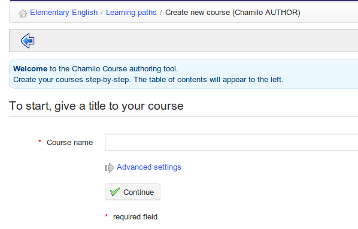
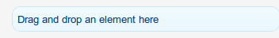
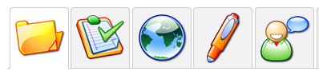
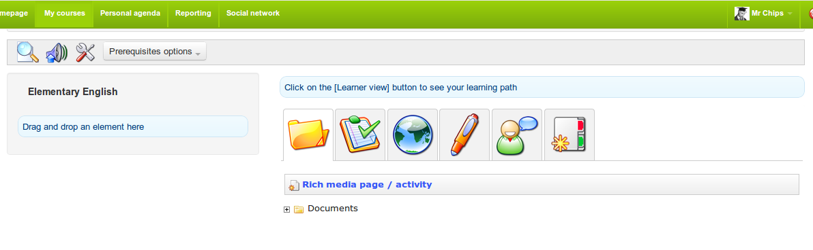
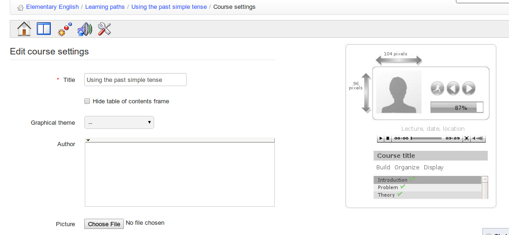

## Create a learning path {#create-a-learning-path}

_Click on the create new course_[^] _icon:___

*Illustration 75: Learning paths - Creating a new learning path*

Give a name to your learning path and click _Continue_. The learning path is created immediately (without content for the time being). It will appear in the learning paths list. Once the learning path is created, you get access to a series of tools to:

*   update the learning path&#039;s settings 

*   add and order elements as you build the learning path 

*   add an activity / object / document 

*   add a new section 

*   use a preview screen to check how it&#039;s going to look for learners

*Illustration 76: Learning paths – Learning paths – Adding a learning object or activity*

### Learning path&#039;s settings {#learning-path-s-settings}

Clicking on the settings icon  will open the settings page. The example image on the right of the form represents what will be seen by the learner when using the learning path, depending on the options configured in the form.

*Illustration 77: Learning paths – Settings*

[^]: Note that Chamilo uses the simple term “course” here rather than “learning path”. Don&#039;t confuse this with the the term “course” as applied to the overall course (Learn English in the illustration)