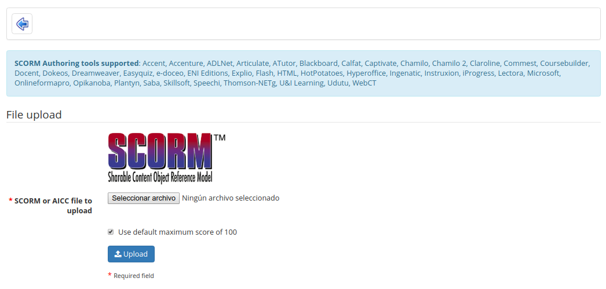

## Import AICC and SCORM {#import-aicc-and-scorm}

Chamilo uses standards like [SCORM](http://fr.wikipedia.org/wiki/Sharable_Content_Object_Reference_Model) and [AICC](http://fr.wikipedia.org/wiki/Aviation_Industry_CBT_Committee) for the exchange of contents. Importing such files couldn&#039;t be easier. Click the Learning Path icon on the _Learning paths_ page:

Illustration 83: Learning paths - Import SCORM

Click _choose file to_ select the relevant document on your hard disk and _send_ to upload it. That&#039;s it. Your imported course is ready to use.

**Note** : Chamilo 1.8 and all its derivations (including D0keos) only support SCORM in version 1.2.