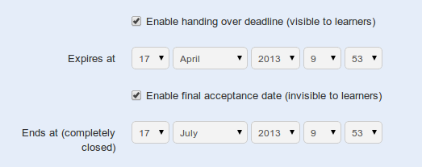

## Fechas de caducidad de la tarea {#fechas-de-caducidad-de-la-tarea}

Chamilo ofrece dos opciones que limitan el tiempo de finalización para las tareas:

*   una &quot;fecha de vencimiento&quot;: es la fecha a partir de la cual todas las tareas enviadas por los alumnos a la plataforma serán marcadas como &quot;expiradas&quot; en rojo en la lista de tareas. Pasada este fecha, las tareas se pueden enviar, pero aparecerán marcadas par indicar el retraso en la entrega.

*   una &quot;fecha de finalización&quot;: es la fecha a partir de la cual se hace imposible para los alumnos enviar una tarea. Es la fecha definitiva a partir de la cual el docente no tendrá en cuenta cualquier trabajo enviados.

Para configurar esto, selecciona las casillas correspondientes en las _opciones avanzadas_ de la página de _Crear tareas_.

*Ilustración 112:Tareas – opciones de para fechas de expiración*