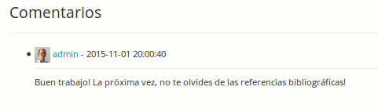

## Marcar tareas {#marcar-tareas}

Para marcar un documento cargado por un alumno, ve a la página principal de la tarea correspondiente. En el lado derecho de la columna _Detalles,_ pulsa sobre el icono _Salvar_ _para guardar_ y ver un archiva que haya presentado el alumno, a continuación pulsar sobre el icono de _Corregir y_ calificar  para añadir un comentario y una puntuación. Si el estudiante no ha subido un archivo, pero presentó su tarea utilizando el editor en linea, el icono de guardar no se mostrará - en su lugar la tarea del estudiante aparecerá directamente en el editor en línea para que el profesor pueda añadir comentarios, puntuar el trabajo, etc.

*Ilustración 113: Corrigiendo las tareas de los estudiantes*

En versiones anteriores a la 1.10, era necesario indicar sus comentarios en el mismo campo de la respuesta textual del alumno. Ahora, aunque imperfecto, es posible dejar un comentario en un campo separado que tiene, además, historial.

*Ilustración 114: Los comentarios dejados con las tareas ahora se registran en un listado a parte*

El resultado y el comentario, no obstante, tienen que ser guardados separadamente (es decir son dos operaciones sucesivas).