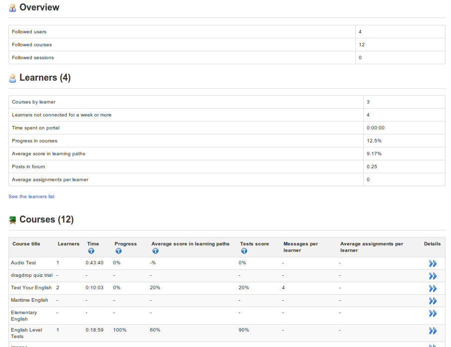

## Own courses and sessions reporting {#own-courses-and-sessions-reporting}

The main page of the R_eporting_ tab displays summary tables offering a general overview, some statistics relating to users on your courses (each entry shows some statistical data which allows you to track the progress and the results of all learners as an average value) , and a list of courses and sessions for which you are responsible:

*Illustration 186: Reporting tab – main page*

Clicking the _Details_ icon  will show you a more detailed list for that specific course or session. Clicking on further _Details_ icon in any of those screens will show you a deeper level of detail. There are about 4-5 levels of detail and this guide does not cover them all. We recommend you take some time to have a look through all the options and see which report best meets your needs.