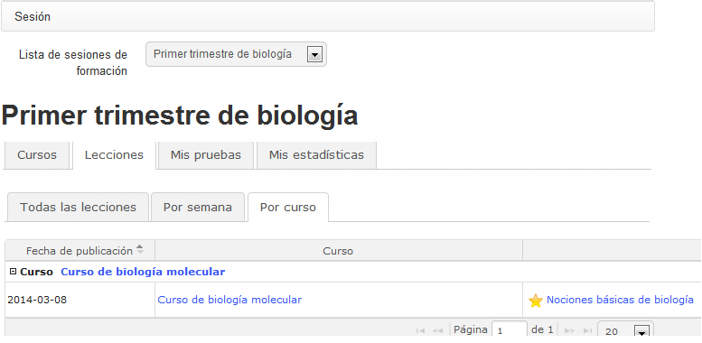

## Pestaña lecciones {#pesta-a-lecciones}

La pestaña de Lecciones muestra la lista de lecciones de la sesión, filtrada de acuerdo al curso (siempre que hayas hecho clic en un curso de la primera pestaña).

*Ilustración 208: Sesiones – Lecciones*

La fecha de publicación de cada lección te da una idea del orden cronológico de las lecciones. Cuando tienes varios cursos simultáneos (lo que podría ser el caso en una sesión) ofreciendo todos ellos varias lecciones, organizar correctamente el calendario de lecciones puede proporcionar al alumno una orientación clara del orden que esperamos que él siga. El alumno puede acceder directamente a una lección desde esta pantalla, simplemente haciendo clic en su nombre.

> **Nota** : Hay tres formas de vista para lecciones: _Todas, por semana, por curso._ Esto no afecta a la forma en que los contenidos están ordenados, así que no dudes en probarlas.