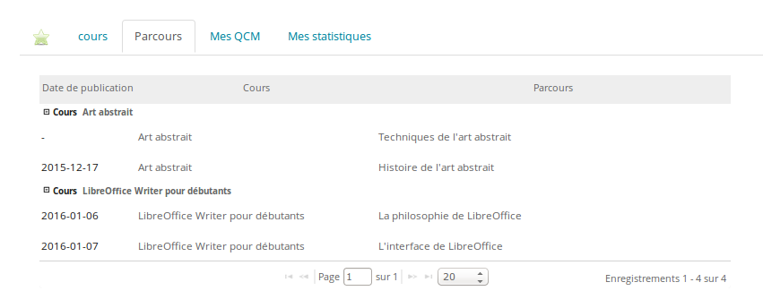

## Onglet parcours {#onglet-parcours}

Cet onglet donne une liste des parcours de la session, filtrés sur le cours actif si l&#039;on a cliqué sur l&#039;un des cours dans l&#039;onglet _Cours_.

Illustration 214: Sessions - Parcours

La date de publication de chaque parcours permet d&#039;avoir une idée de la chronologie des parcours. Dans le cas de plusieurs cours simultanés (comme c&#039;est le cas dans une session) qui proposent chacun plusieurs parcours, on pourra attendre de la part de l&#039;apprenant qu&#039;il suive les parcours dans l&#039;ordre chronologique proposé.

À partir de cet écran, l&#039;apprenant peut entrer directement dans ses parcours en cliquant sur leur nom.

**Note** : il existe 3 types de vue pour les parcours : **Tous, Par semaine******et **Par cours**. Ils n&#039;affectent que la manière dont s&#039;affichent leurs contenus, donc n&#039;hésitez pas à les essayer.