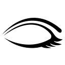

## Common interface elements {#common-interface-elements}

Because we know that common conventions make things easier for everybody to remember and manipulate, we use a set of common visual symbols throughout Chamilo. These symbols might stand alone representing an action, or be coupled with another symbol representing the object of the action.

Below are listed some of the most commonly used symbols on the platform:

| Icons | Features |
| :-: | --- |
|  | The pencil tool allows the **updating** of a specific piece of information or content |
|  | The cross tool allows for the **deletion** of a specific piece of information or content |
|  | The eye tool allows you to change the **visibility** of a piece of information/ content |
|  | The **yellow star** marker on any icon symbolizes the **creation** of a **new** resource |
|  | A blue right arrow generally means **move things** or **insert things** into others |
|  | A blue left arrow generally means **go back** (like the back button in your browser). |
|  | A blue arrow pointing down generally means **download** some file or data. |
|  | A blue arrow pointing upwards generally means **upload** some file or data. |